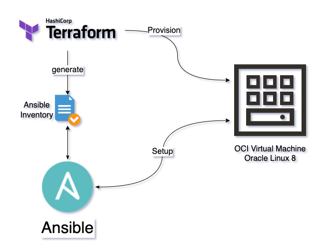

# OCI Linux Python App

This repository is an example of a Terraform and Ansible deployment of a Linux instance with Python App installed as Systemd Unit.

The Python App will be listening to port 3000.

> Recommendation:
> 
> git clone this repository on OCI Cloud Shell
> 
>   `git clone git@github.com:vmleon/oci-linux-python-app.git`
> 
> Follow the steps in **How-to**



## How-to

### Terraform

Terraform is going to deploy all the network necessary. Virtual Cloud Network, Internet Gateway, Subnets and Route Tables as well as open port for the Python App with a Security List.

Then, Terraform is going to deploy the Linux compute instance.

Change to `terraform` folder:

```
cd terraform
```

There are mainly two files: `network.tf` and `compute.tf` that contains all the terraform scripts to deploy the IaaS.

Init Terraform provider:
```
terraform init
```

Plan the deployment
```
terraform plan
```

> Answer `yes` when asked

If no errors, Apply the deployment
```
terraform apply
```

> Answer `yes` when asked

### Ansible

Ansible is going to provision the linux with all the necessary tools and the python application.

From the `terraform` folder:

```
ansible-playbook -i generated/app.ini ../ansible/server/server.yaml
```

When asked:

```
Are you sure you want to continue connecting (yes/no/[fingerprint])?
```

Answer `yes` and enter.

## Python App

You can SSH into the machine with:

```
ssh opc@<PUBLIC_IP>
```

And test the application with:

```
curl <PUBLIC_IP>:3000
```

You can change the code (`vim`) and reload the app with:

```
sudo systemctl restart app
```
